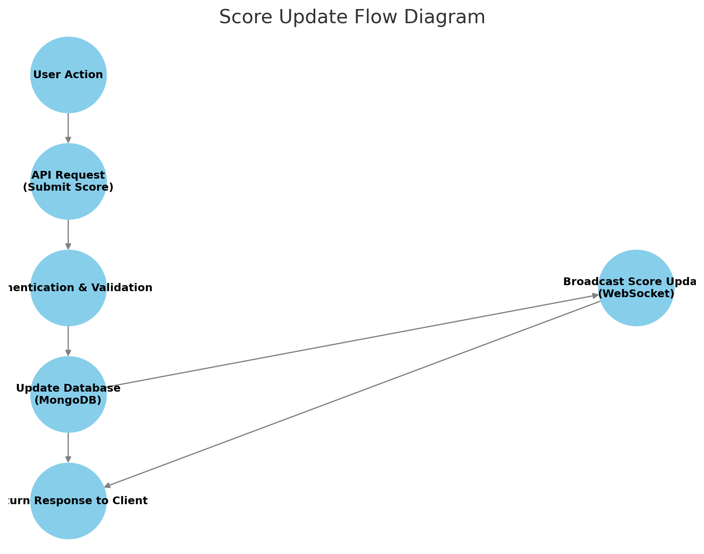

# API Service Architecture Specification

## Overview
This document outlines the specification for a software module on the API service (backend application server) responsible for managing a **scoreboard** system. It provides documentation on system behavior, execution flow, security measures, and necessary improvements.

---


## **Software Requirements**
1. The application features a **scoreboard** displaying the top 10 users' scores.
2. The scoreboard should **update live** to reflect the latest scores.
3. A **user action** (e.g., game achievement) triggers an increase in the user’s score.
4. Once completed, the action **dispatches an API call** to update the score.
5. The system must implement **security measures** to prevent unauthorized score manipulations.

---

## **API Endpoints**

### **1. Retrieve Top Scores**
- **Endpoint**: `GET /api/scores/top`
- **Description**: Fetches the top 10 highest scores from the leaderboard.
- **Response Example:**
```json
[
  { "username": "Player1", "score": 1500 },
  { "username": "Player2", "score": 1400 }
]
```

### **2. Submit a Score Update**
- **Endpoint**: `POST /api/scores/update`
- **Description**: Updates the user’s score upon completing an action.
- **Request Body:**
```json
{
  "userId": "12345",
  "score": 50
}
```
- **Security Measures**:
  - Validate the action is **legitimate** before updating the score.
  - Use authentication (JWT or API key) to verify requests.
  - Prevent tampering by **verifying** score increments on the backend.

### **3. Real-time Score Updates (WebSocket)**
- **Endpoint**: `ws://api.example.com/scores/live`
- **Description**: Provides a WebSocket connection for live score updates.
- **Implementation**:
  - Clients subscribe to score updates.
  - The server pushes updates **only when necessary**.

---

## **Security Considerations**
- **Authentication & Authorization**
  - Implement **JWT-based authentication** for API access.
  - Restrict score update access to verified users only.

- **Rate Limiting & Anti-Tampering**
  - Limit score update requests **per user per minute**.
  - Use **server-side validation** to prevent fake updates.

- **Data Integrity**
  - Store scores in a **secure database** (e.g., MongoDB with encryption).
  - Use **server-verified actions** to update scores instead of direct user inputs.

---

## **Flow Diagram** (To Be Added)


---

## **Handoff to Backend Team**
This document serves as a foundation for implementing the scoreboard module. The backend engineering team will take this specification to develop, test, and deploy the API service.

---

## **Next Steps**
- **Review and refine security measures** before deployment.
- **Create a flow diagram** to visualize request processing.
- **Write unit tests** to ensure API reliability.


